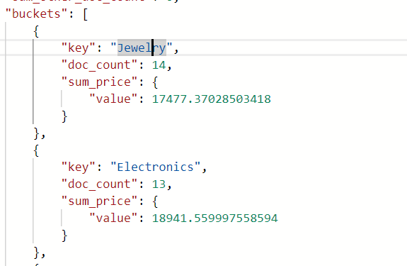
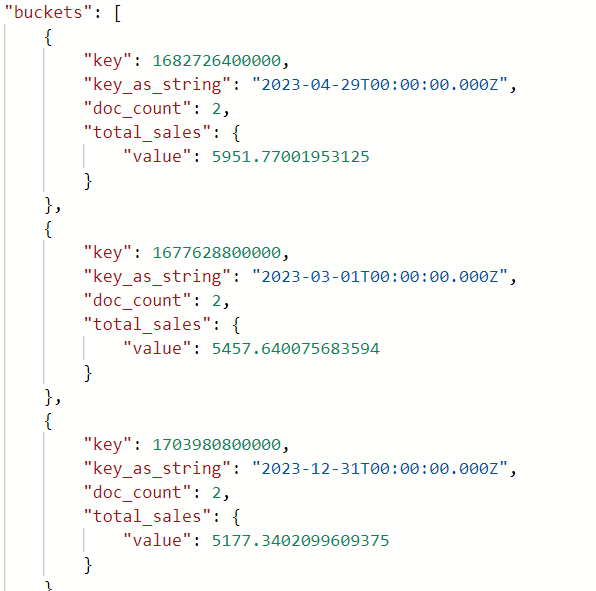

# 《实验三》  
>**学院:省级示范性软件学院**
>
> **课程:** 高级数据库技术与应用
>
>**题目:**《实验三：聚合操作练习》
>
>**姓名**: 刘乐
>
>**学号**: 2200770085
>
>**班级**: 软工2204
>
>**日期**: 2024-10-12
>
>**实验环境**: Elasticsearch8.12.2 Kibana8.12.2
##  一、实验目的
#### 学习并掌握es的聚合操作
## 二、实验内容
#### 完成电商数据分析聚合操作练习

- 统计每个产品类别的总销售额。
 
        {
        "size":0,
        "aggs": {
            "categories": {
            "terms": {
                "field": "product_category"
            },
            "aggs": {
                "sum_price": {
                "sum": {
                    "field": "total_amount"
                }
                }
            }
            }
        }
        }
    
    
- 计算每个城市的平均订单金额

        {
        "size":0,
        "aggs": {
            "city": {
            "terms": {
                "field": "customer_city"
            },
            "aggs": {
                "avg_price": {
                "avg": {
                    "field": "total_amount"
                }
                }
            }
            }
        }
        }
    
- 找出销量最高的前5个产品。

        {
            "size":0,
            "aggs":{
                "top5_product":{
                "terms":{
                    "field":"product_name",
                    "size":5,
                    "order":{
                    "total_sales":"desc"
                    }
                },
                "aggs":{
                    "total_sales":{
                    "sum":{
                        "field":"quantity"
                    }
                    }
                }
                }
            }
        }
    
- 计算男性和女性客户的平均年龄。
 
        {
            "size":0,
            "aggs": {
                "gender_avg": {
                "terms":{
                    "field":"customer_gender"
                },
                "aggs":{
                    "avg_age":{
                    "avg":{
                        "field":"customer_age"
                    }
                    }
                }
                }
                
            }
            
        }
    
- 统计每种支付方式的使用次数和总金额。

        {
            "size":0,
            "aggs": {
                "cishuhezongjine": {
                    "terms":{
                    "field":"payment_method"
                    },
                "aggs":{
                    "zongjine":{
                    "sum":{
                    "field":"total_amount"
                    }
                }
                }
                
                }
            }
            
        }
    
- 计算每月的总销售额。
 
        {  
        "size": 0,  
        "aggs": {  
            "sales_per_month": {  
            "date_histogram": {  
                "field": "order_date",  
                "calendar_interval": "month",  
                "format": "yyyy-MM"  
            },  
            "aggs": {  
                "total_sales": {  
                "sum": {  
                    "field": "total_amount"  
                }  
                }  
            }  
            }  
        }  
        }
    
- 找出平均订单金额最高的前3个客户。
 
        {  
        "size": 0,  
        "aggs": {  
            "customer_avg_order_value": {  
            "terms": {  
                "field": "customer_id",  
                "size": 3,  
                "order": {  
                "avg_order_value": "desc"  
                }  
            },  
            "aggs": {  
                "avg_order_value": {  
                "avg": {  
                    "field": "total_amount"  
                }  
                }  
            }  
            }  
        }  
        }
    
- 计算每个年龄段（18-30，31-50，51+）的客户数量。
 
        {  
        "size": 0,  
        "aggs": {  
            "age_groups": {  
            "range": {  
                "field": "customer_age",  
                "ranges": [  
                { "from": 18, "to": 30 },  
                { "from": 31, "to": 50 },  
                { "from": 51 }  
                ]  
            },  
            "aggs": {  
                "customer_count": {  
                "value_count": {  
                    "field": "customer_id"  
                }  
                }  
            }  
            }  
        }  
        }
    
- 计算每个产品类别的平均单价。
 
        {  
        "size": 0,  
        "aggs": {  
            "avg_price_per_category": {  
            "terms": {  
                "field": "product_category"  
            },  
            "aggs": {  
                "avg_price": {  
                "avg": {  
                    "field": "price"  
                }  
                }  
            }  
            }  
        }  
        }
     
- 找出订单数量最多的前5个城市。
 
        {  
        "size": 0,  
        "aggs": {  
            "orders_per_city": {  
            "terms": {  
                "field": "customer_city",  
                "size": 5,  
                "order": {  
                "_count": "desc"  
                }  
            }  
            }  
        }  
        }
    
- 计算每个季度的平均订单金额。
   
        {  
        "size": 0,  
        "aggs": {  
            "avg_order_value_per_quarter": {  
            "date_histogram": {  
                "field": "order_date",  
                "calendar_interval": "quarter",  
                "format": "yyyy-Q"  
            },  
            "aggs": {  
                "avg_order_value": {  
                "avg": {  
                    "field": "total_amount"  
                }  
                }  
            }  
            }  
        }  
        }
    
- 统计每个产品类别中的商品数量。
    
        {  
        "size": 0,  
        "aggs": {  
            "product_count_per_category": {  
            "terms": {  
                "field": "product_category"  
            },  
            "aggs": {  
                "product_count": {  
                "value_count": {  
                    "field": "product_id"  
                }  
                }  
            }  
            }  
        }  
        }
    
- 计算男性和女性客户的平均订单金额。

        {  
        "size": 0,  
        "aggs": {  
            "gender_avg_order_value": {  
            "terms": {  
                "field": "customer_gender"  
            },  
            "aggs": {  
                "avg_order_value": {  
                "avg": {  
                    "field": "total_amount"  
                }  
                }  
            }  
            }  
        }  
        }
    
- 找出总销售额最高的前10个日期。
   
        {  
        "size": 0,  
        "aggs": {  
            "top_sales_dates": {  
            "terms": {  
                "field": "order_date",  
                "size": 10,  
                "order": {  
                "total_sales": "desc"  
                }  
            },  
            "aggs": {  
                "total_sales": {  
                "sum": {  
                    "field": "total_amount"  
                }  
                }  
            }  
            }  
        }  
        }
    
- 计算每个季度销售额最高的产品类别。
  
        {  
        "size": 0,  
        "aggs": {  
            "sales_per_quarter": {  
            "date_histogram": {  
                "field": "order_date",  
                "calendar_interval": "quarter",  
                "format": "yyyy-Q"  
            },  
            "aggs": {  
                "top_sales_category": {  
                "terms": {  
                    "field": "product_category",  
                    "size": 1,  
                    "order": {  
                    "category_sales": "desc"  
                    }  
                },  
                "aggs": {  
                    "category_sales": {  
                    "sum": {  
                        "field": "total_amount"  
                    }  
                    }  
                }  
                }  
            }  
            }  
        }  
        }
    
- 比较本月销售额与上月销售额的差异。
 
        {  
        "size": 0,  
        "aggs": {  
            "sales_per_month": {  
            "date_histogram": {  
                "field": "order_date",  
                "calendar_interval": "month",  
                "format": "yyyy-MM",  
                "order": {  
                "_key": "desc"  
                }
            },  
            "aggs": {  
                "total_sales": {  
                "sum": {  
                    "field": "total_amount"  
                }  
                }  
            }  
            }  
        }  
        }
    
## 三、问题及解决方法