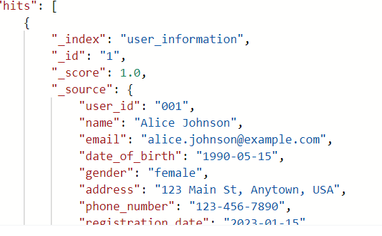
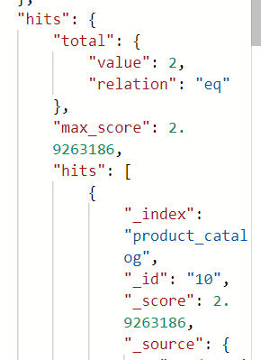
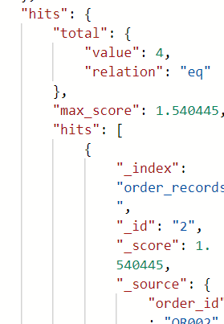

# 《实验一》  
>**学院:省级示范性软件学院**
>
>**题目:**《实验二：索引操作与文档操作练习》
>
>**姓名**: 刘乐
>
>**学号**: 2200770085
>
>**班级**: 软工2204
>
>**日期**: 2024-9-14
>
>**实验环境**: Elasticsearch8.12.2 Kibana8.12.2
##  一、实验目的
1. 掌握Elasticsearch 安装IK分词器安装方法
2. 掌握Elasticsearch 索引操作方法
3. 掌握Elasticsearch 文档操作训练
4. 掌握Elasticsearch 高级查询与DSL训练
##  二、实验内容
###  1. 索引操作练习
- **根据字段描述创建索引**
  - 用户信息索引

        {
          "mappings":{
          "properties":{
            "user_id":{
                "type":"keyword"
            },
            "name":{
                "type":"text"
            },
            "email":{
                "type":"keyword"
            },
            "date_of_birth":{
                "type":"date"
            },
            "gender":{
                "type":"keyword"
            },
            "address":{
                "type":"text"
            },
            "phone_number":{
                "type":"keyword"
            },
            "registration_date":{
                "type":"date"
            },
            "last_login":{
                "type":"date"
            },
            "status":{
                "type":"keyword"
            }
            }
          }   
        }
      
  - 产品目录索引
    
        {
        "mappings":{
            "properties":{
                "product_id":{
                    "type":"keyword"
                },
                "name":{
                    "type":"text"
                },
                "description":{
                    "type":"text"
                },
                "category":{
                    "type":"keyword"
                },
                "price":{
                    "type":"double"
                },
                "stock_quantity":{
                    "type":"integer"
                },
                "supplier":{
                    "type":"keyword"
                },
                "release_date":{
                    "type":"date"
                },
                "tags":{
                    "type":"keyword"
                },
                "rating":{
                    "type":"float"
                }
            }
          }
        }
    
  - 订单记录索引
      
        {
        "mappings":{
            "properties":{
                "order_id":{
                    "type":"keyword"
                },
                "customer_id":{
                    "type":"keyword"
                },
                "order_date":{
                    "type":"date"
                },
                "status":{
                    "type":"keyword"
                },
                "total_amount":{
                    "type":"double"
                },
                "items":{
                    "type":"nested"
                },
                "shipping_address":{
                    "type":"text"
                },
                "shipping_method":{
                    "type":"keyword"
                },
                "payment_method":{
                    "type":"keyword"
                },
                "shipping_date":{
                    "type":"date"
                },
                "delivery_date":{
                    "type":"date"
                }
              }
            }
        }
        
          
- **修改索引**
  - **添加常用收货shipping_address** (方便用户)

        {
        "properties":{
            "shipping_address":{
                "type":"text"
            }
        }
        }
    
- **删除索引**

- **查看索引**

### 2.文档操作练习
- 创建文档
    
        POST http://localhost:9200/user_information/_doc/30
        {"user_id":"OR030"}
    

- 修改文档
      
        POST http://localhost:9200/user_information/_doc/30
        {"user_id":"OR0301"}
    
- 删除文档
        
        DELETE http://localhost:9200/user_information/_doc/30
       

- 查看文档
        
        GET http://localhost:9200/user_information/_doc/30
    
- 将下面的Json数据批量导入ES数据中
  **使用_bulk批量插入**
  1. 插入用户信息数据
  
  2. 插入产品目录信息 
  
  2. 插入订单记录数据
  
### 3.高级查询&DSL语句练习
-   用户信息数据
1. 查询所有女性用户的姓名和电子邮件。

        {  
        "query": {  
            "term": {  
            "gender": "female"  
            }  
        },  
        "_source": ["name", "email"]  
        }
    
2. 查找最后登录日期在2024年9月1日之后的所有活跃用户。

        {  
        "query": {  
            "bool": {  
            "must": [  
                {  
                "range": {  
                    "last_login": {  
                    "gt": "2024-09-01"  
                    }  
                }  
                },  
                {  
                "term": {  
                    "status": "active"  
                }  
                }  
            ]  
            }  
        }  
        }
    
3. 查询住在"Anytown"的用户。
        
        {  
        "query": {  
            "match": {  
            "address": "Anytown"  
            }  
        }  
        }
    
4. 查找出生日期在1990年之后的所有用户。
        
        {  
        "query": {  
            "range": {  
            "date_of_birth": {  
                "lt": "1990-01-01"  
            }  
            }  
        }  
        }
    
5. 查询所有状态为"inactive"的用户。

        {  
        "query": {  
            "term": {  
            "status": "inactive"  
            }  
        }  
        }
    
6. 查找注册日期在2023年1月1日到2023年12月31日之间的用户。

        {  
        "query": {  
            "range": {  
            "registration_date": {  
                "gte": "2023-01-01",  
                "lte": "2023-12-31"  
            }  
            }  
        }  
        }
    
7. 查询名字为"Bob Smith"的用户的详细信息。

        {  
        "query": {  
            "match_phrase": {  
            "name": "Bob Smith"  
            }  
        }  
        }
    
8. 查找电话号码以"123"开头的用户。

        {  
        "query": {  
            "wildcard": {  
            "phone_number": "123*"  
            }  
        }  
        }
    
9. 查询电子邮件域为"example.com"的所有用户。

        {  
        "query": {  
            "wildcard": {  
            "email": "*@example.com"  
            }  
        }  
        }
    
10. 查找所有名字中包含"Lee"的用户。

        {  
        "query": {  
            "match": {  
            "name": "Lee"  
            }  
        }  
        }
    
-   产品目录数据
1. 查询所有类别为"Audio"的产品名称和价格。
        
        {  
        "query": {  
            "term": {  
            "category": "Audio"  
            }  
        },  
        "_source": ["name", "price"]  
        }
    
2. 查找价格高于50美元的所有产品。

            {  
            "query": {  
                "range": {  
                "price": {  
                    "gt": 50  
                }  
                }  
            }  
            }
    
3. 查询库存数量少于100的产品。

            {  
        "query": {  
            "range": {  
            "stock_quantity": {  
                "lt": 100  
            }  
            }  
        }  
        }
    
4. 查找评分高于4.5的所有产品。

            {  
        "query": {  
            "range": {  
            "rating": {  
                "gt": 4.5  
            }  
            }  
        }  
        }
    
5. 查询标签中包含"smart"的所有产品。

                {  
        "query": {  
            "match": {  
            "tags": "smart"  
            }  
        }  
        }
    
6. 查找供应商为"TechCorp"的产品。

        {  
        "query": {  
            "term": {  
            "supplier": "TechCorp"  
            }  
        }  
        }
    
7. 查询发布日期在2023年6月1日之后的所有产品。

        {  
        "query": {  
            "range": {  
            "release_date": {  
                "gt": "2023-06-01"  
            }  
            }  
        }  
        }
    
8. 查找描述中包含"wireless"的产品。

        {  
        "query": {  
            "match": {  
            "description": "wireless"  
            }  
        }  
        }
    
9. 查询价格在20美元到100美元之间的所有产品。
        
        {  
        "query": {  
            "range": {  
            "price": {  
                "gte": 20,  
                "lte": 100  
            }  
            }  
        }  
        }
    
10. 查找产品名称中包含"Light"的所有产品。
        
        {  
        "query": {  
            "match": {  
            "name": "Light"  
            }  
        }  
        }
    
-   订单记录数据
1. 查询所有状态为"completed"的订单的订单ID和总金额。

        {  
        "query": {  
            "term": {  
            "status": "completed"  
            }  
        },  
        "_source": ["order_id", "total_amount"]  
        }
    
2. 查找总金额大于100美元的所有订单。

        {  
        "query": {  
            "range": {  
            "total_amount": {  
                "gt": 100  
            }  
            }  
        }  
        }
    
3. 查询支付方式为"paypal"的订单。

        {  
        "query": {  
            "term": {  
            "payment_method": "paypal"  
            }  
        }  
        }
    
4. 查找订单日期在2024年2月之后的所有订单。

        {  
        "query": {  
            "range": {  
            "order_date": {  
                "gt": "2024-02-01"  
            }  
            }  
        }  
        }
    
5. 查询包含产品ID为"P001"的订单。

        {  
        "query": {  
            "nested": {  
            "path": "items",  
            "query": {  
                "term": {  
                "items.product_id": "P001"  
                }  
            }  
            }  
        }  
        }
    
6. 查找所有状态为"cancelled"的订单的客户ID。

        {  
        "query": {  
            "term": {  
            "status": "cancelled"  
            }  
        },  
        "_source": ["customer_id"]  
        }
    
7. 查询发货日期在2024年1月15日之前的订单。

        {  
        "query": {  
            "range": {  
            "shipping_date": {  
                "lt": "2024-01-15"  
            }  
            }  
        }  
        }
    
8. 查找使用"credit_card"支付的订单。

        {  
        "query": {  
            "term": {  
            "payment_method": "credit_card"  
            }  
        }  
        }
    
9. 查询总金额在50美元到200美元之间的所有订单。

        {  
        "query": {  
            "range": {  
            "total_amount": {  
                "gte": 50,  
                "lte": 200  
            }  
            }  
        }  
        }
    
10. 查找订单ID中包含"OR01"的所有订单。

        {  
        "query": {  
            "wildcard": {  
            "order_id": "*OR01*"  
            }  
        }  
        }
    
##  三、问题及解决方法
- **restful API 的种类与功能混淆**

post 增 delete 删 get 查 **put 改**
在es中创建索引要用PUT，修改索引也是PUT
- **DSL语法错误**
  - **不能用"mapping"，要用 **"mappings"**
    
  - 修改索引要使用 **_mapping**
  ![alt text]./image/(image-8.png)
  - 批量操作 **_bulk** 
    操作和参数**各占一行**
    